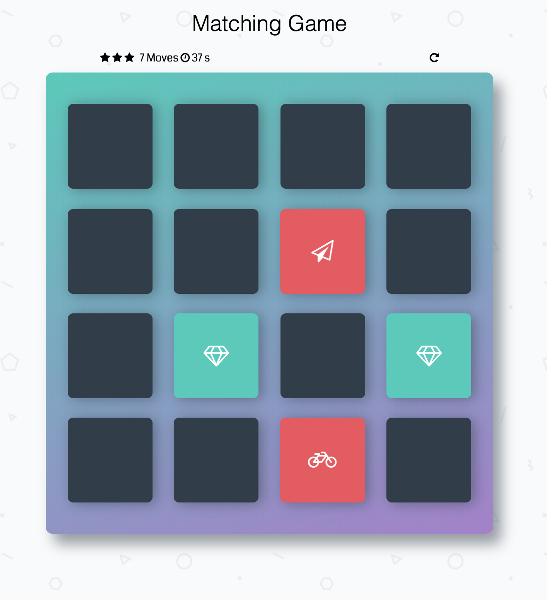

# Memory Game Project
Memory Game is a card matching game where players have to flip over cards 2 at a time until they match all the different card pairs. This project is implemented in HTML/CSS and vanilla Javascript.



## Table of Contents

- [Instructions](#instructions)
- [Game Rules](#rules)
- [Features](#features)
- [Development](#development)

## Instructions
* Demo version: [Play Now!](https://memory-game-jzy.netlify.app/)
* To play, just open [index.html](./index.html) from the cloned repo in your browser.

## Game Rules

* To win, flip over and match all the cards before the time runs out

## Features
- Game Timer (Records time taken by player to match all card pairs)
- Card Animations (CSS Animation for various card flip interactions)
- Restart Game

## Development
To setup the app for development on your local machine, please follow the instructions below:
1. Clone the repo to your machine
```
git clone https://github.com/bilafish/memory-game.git
```
2. Edit the Javascript code in folder [js](./js/)
